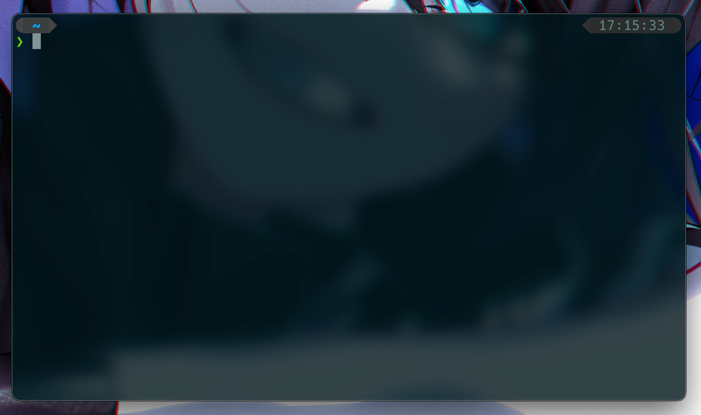
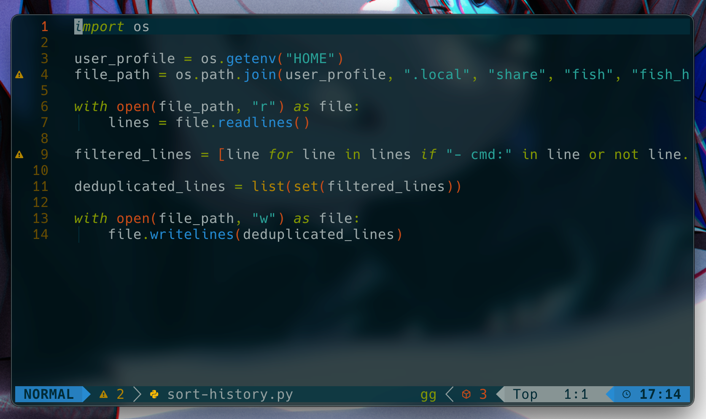
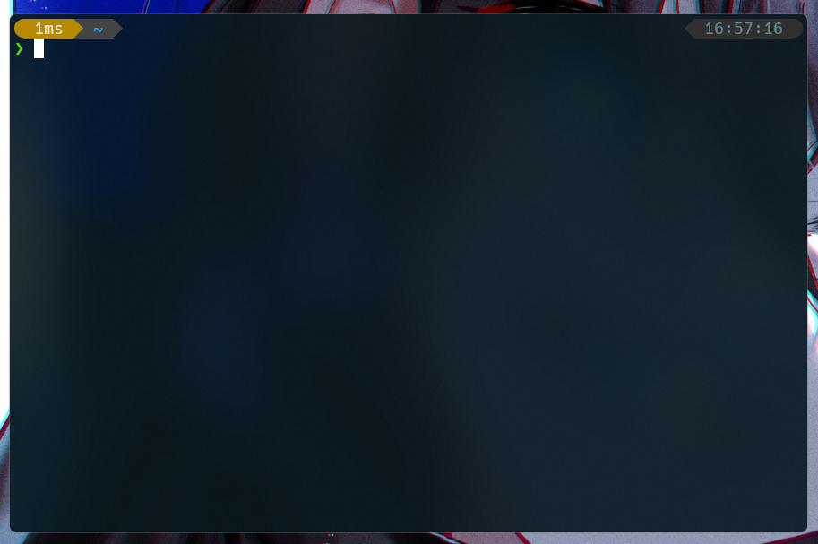
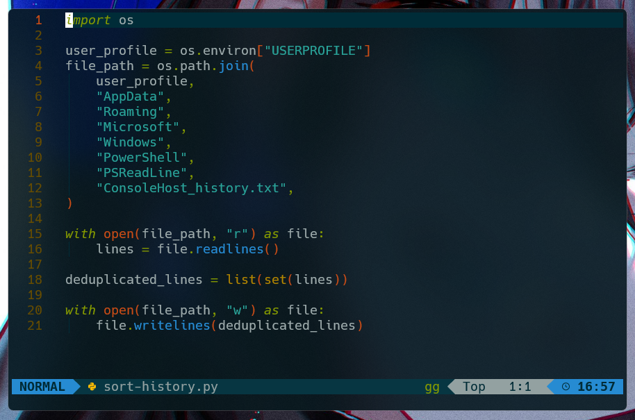

## Jirateep's dotfiles

Warning: Don’t blindly use my settings unless you know what that entails. Use at your own risk!




### Setup `neovim` (macos & linux)

```zsh
# Install homebrew
/bin/bash -c "$(curl -fsSL https://raw.githubusercontent.com/Homebrew/install/HEAD/install.sh)"

# Install essential packages using homebrew
brew install fish curl jq tmux neovim gcc make gzip eza git-delta bat fzf ripgrep fd python ffmpeg

# Install additional applications using homebrew
brew install --cask iterm2 visual-studio-code android-studio docker responsively postman karabiner-elements alt-tab rectangle shottr dropzone notion parsify obs anydesk keycastr keyboardcleantool appcleaner spotify discord

# Install fisher and plugins for fish shell
curl -sL https://raw.githubusercontent.com/jorgebucaran/fisher/main/functions/fisher.fish | source && fisher install jorgebucaran/fisher
fisher install jorgebucaran/nvm.fish
fisher install ilancosman/tide@v6
fisher install jethrokuan/z
fisher install PatrickF1/fzf.fish

# Set default version for nvm and install global npm packages
set --universal nvm_default_version
npm i -g npm-check-updates nodemon commitizen cz-conventional-changelog

# Configure commitizen to use conventional changelog
echo '{ "path": "cz-conventional-changelog" }' > $HOME/.czrc

# Instructions for configuring fish shell and adding homebrew binaries to its path
# 1. Add fish shell to the list of known shells: sudo sh -c 'echo "$(which fish)" >> /etc/shells'
# 2. Restart your terminal
# 3. Set fish shell as the default shell: chsh -s "$(which fish)"
# 4. Restart your terminal and verify if it launched with fish shell
# 5. Add homebrew binaries to fish shell's path: fish_add_path (dirname (which brew))
```

---




### Setup `neovim` (windows)

```powershell
# Install powershell
winget install --id Microsoft.Powershell -s winget

# Install git
winget install --id Git.Git -e -s winget

# Install oh my posh
winget install --id JanDeDobbeleer.OhMyPosh -e -s winget

# Install powershell modules
Install-Module posh-git -Scope CurrentUser -Force
Install-Module z -Scope CurrentUser -Force
Install-Module PSReadline -Scope CurrentUser -Force
Install-Module PSFzf -Scope CurrentUser -Force

# Install scoop
iwr -useb get.scoop.sh | iex

# Install essential packages using scoop
scoop install curl sudo jq neovim gcc make gzip eza delta bat fzf ripgrep fd python ffmpeg nvm

# If encountering issues opening neovim after installation, install vcredist2022 from extras bucket
scoop bucket add extras
scoop install vcredist2022

# Install python 3.10 from versions bucket (if needed)
scoop bucket add versions
scoop install python310

# Install global npm packages
npm i -g npm-check-updates nodemon commitizen cz-conventional-changelog

# Configure commitizen to use conventional changelog
echo '{ "path": "cz-conventional-changelog" }' > $ENV:USERPROFILE\.czrc
```

- then type nvim `$PROFILE`

```ps1
[console]::InputEncoding = [console]::OutputEncoding = New-Object System.Text.UTF8Encoding

Import-Module posh-git

$omp_config = Join-Path $PSScriptRoot "user_profile.omp.json"
oh-my-posh --init --shell pwsh --config $omp_config | Invoke-Expression

Set-PSReadLineOption -EditMode Emacs
Set-PSReadLineOption -BellStyle None
Set-PSReadLineKeyHandler -Chord "enter" -Function ValidateAndAcceptLine
Set-PSReadLineKeyHandler -Chord "ctrl+d" -Function DeleteChar
Set-PSReadLineOption -PredictionSource History
Set-PSReadLineOption -PredictionViewStyle InlineView
Set-PSReadLineOption -HistoryNoDuplicates

Import-Module PSFzf

Set-PsFzfOption -PSReadlineChordProvider "ctrl+f" -PSReadlineChordReverseHistory "ctrl+r"

Set-Alias -Name vim -Value nvim
Set-Alias grep findstr
Set-Alias tig "C:\Program Files\Git\usr\bin\tig.exe"
Set-Alias less "C:\Program Files\Git\usr\bin\less.exe"
Set-Alias g git
Set-Alias ytd "$ENV:USERPROFILE\AppData\Local\script\yt-download.sh"
Set-Alias cleanup "$ENV:USERPROFILE\AppData\Local\script\cleanup.sh"
Set-Alias initial-command "$ENV:USERPROFILE\AppData\Local\script\initial-command.sh"

$sort = $function:prompt
function prompt() {
    python3 "$ENV:USERPROFILE\AppData\Local\script\sort-history.py"
    &$sort
}

function ll() {
  eza -l -g --icons
}

function lla() {
  eza -l -g --icons -a
}

function which ($command) {
  Get-Command -Name $command -ErrorAction SilentlyContinue |
  Select-Object -ExpandProperty Path -ErrorAction SilentlyContinue
}
```

### Setup `visual studio code`

- extensions : [extensions](./uploads/.vscode/extensions.txt)
- settings : [settings](./uploads/.vscode/settings.json)
- keybindings: [settings](./uploads/.vscode/keybindings.json)

### Setup `windows terminal`

- theme: [profile](./uploads/user_profile.omp.json)
- settings: [settings](./uploads/settings.json)
